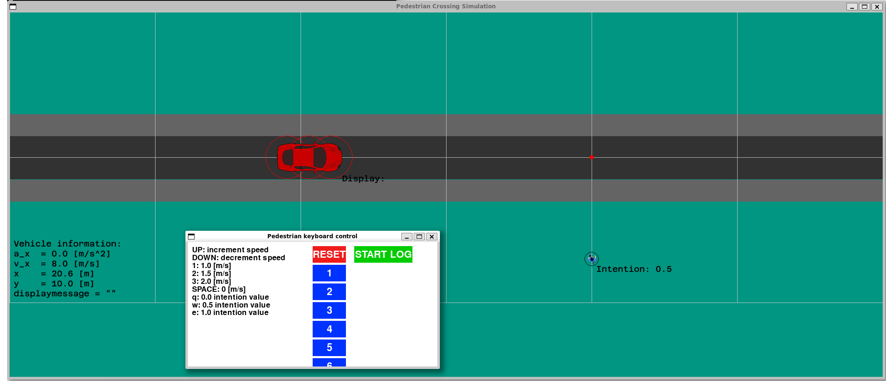
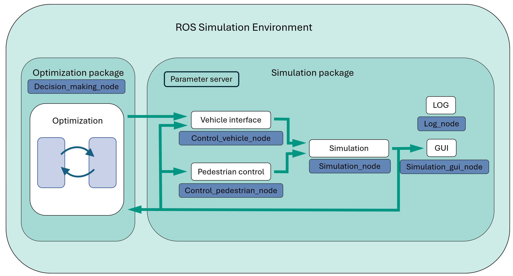

# PTCE-Lecture-Simulation-Framwork

# Instructions on how to build the framework 

## Install WSL:
- Using this [link](https://learn.microsoft.com/en-us/windows/wsl/install) follow the instructions on how to install WSL on your windows machine. 
- Install Ubuntu 22.04.3 LTS
    - Start WSL and set username and password

## Install ROS2
- Follow the official documentation to install ROS2: [link](https://docs.ros.org/en/humble/Installation/Ubuntu-Install-Debs.html)
- The version used is: Ros2 Humble
- Official tutorials can be found [here](https://docs.ros.org/en/humble/Tutorials.html). These teach the basic concepts of ROS. (For your own understanding)

### Create your Workspace
In the terminal execute the following code:
```
mkdir -p ~/ros2_ws/src
cd ~/ros2_ws/src
```
This creates a workspace called "ros2_ws" which includes a source folder "src". Then navigates to the src folder. 

## Connect to Github and clone repository
In order to pull the repository from Github, authentification using HTTPS is necessary. Therefore a access token has to be generated:
- Log into GitLab using your Kit account
- Click on the user icon and go to "Edit profile"
- Select "Access tokens" and add new token -> select a name and "api"
- Save the token (in a file or in your notes) as it functions as a password everytime git is used to push and pull your code

## Fork you repository
Since you have to work on your own, first you have to fork this repository by clicking on right side top, "Fork" button. 

## Clone the repository into your workspace
In the source folder of your workspace clone the forked repository from your personal working space

Insert your username and the password which corresponds to the generated access token. 
Use the following lines to check weather the cloning was successfull:
```
cd practical-tools-for-control-engineers-homework-repo
git status
```

### Create local branch to track remote branches:  TODO Balint
Connect main to remote main:
```
git branch -u origin/main main
```
Create other with tracking:
```
git checkout -t origin/main
```
Checkout (change to) work branch
```
git checkout test-work-branch
```

### Configure Git username and password
Set username and email:
```
git config --global user.name "uxxxx"
```
```
git config --global user.email "uxxxx@student.kit.edu"
```


## Build the Framework

### Install necessary python packages
Install Pip:
```
sudo apt install python3-pip
```
Install Pygame:
```
pip install pygame casadi
```

### Build workspace
[Colcon](https://colcon.readthedocs.io/en/released/user/installation.html) is used to build packages in ROS
```
sudo apt install python3-colcon-common-extensions
```
Build the workspace.
```
cd ~/ros2_ws
colcon build 
```
Build one package seperately using symlink install. Necessary for simulation. 
```
colcon build --packages-select crossing_gui_ros2 --symlink-install
```
Source the workspace in order to run the code. 
```
source install/setup.bash
```
This process has to be repeated if changes to the code is made. 

### Edit .bashrc
.bashrc is a file which is run during startup of a new terminal. 
- Open the bashrc-file using an editor (gedit). 
```
gedit ~/.bashrc 
```
- Add the following lines to (the end of) the file:
```
source ~/ros2_ws/install/setup.bash
source /usr/share/colcon_argcomplete/hook/colcon-argcomplete.bash
source /opt/ros/humble/setup.bash
```

# Install VS code
In order to rework the code and make the homework an editor is necessary/usefull. VS Code may be used. 
You can use the following [link](https://learn.microsoft.com/de-de/windows/wsl/tutorials/wsl-vscode) to install VS Code on windows and use it in WSL. 
After opening VS Code, click in the bottom left corner to connect VS Code to WSL ("Connect to WSL" will pop up at the top of the screen).

On the right side (third icon from top) Github versioning can be used to track, push and pull the changes. 

# Simulation

## Launch 
The simulation can be started using the launch file start_simulation_launch.py using the following command:
```
ros2 launch crossing_gui_ros2 start_simulation_launch.py
```
Two windows will show up. The simulation consisting of a car and a pedestrain and a control panel. They are shown in the following picture. 
Using "rqt_graph" the connections between the nodes can be seen. 

{width=50%}

In the "Pedestrain keyboard control" there are three main functions. **Reset** button to reset the scene. **Start LOG** to start recording of the scene. Afterwards the plot is safed into the workspace (ros2_ws/src/results/documentation/plots/plot_xxx.pdf).
The five **blue buttons** can be used to simulate different scenarios of the crossing. 

## Structure
The following graphic shows the structure of the ROS environment. i.e. how the nodes (blue background) are connected and interact with each other. 
{width=50%}

## Homework
In this task, you will customize the **decision_making_node** to implement a different method for deciding the intersection scenario.

Right now a simple solution is used in order to resolve the problem: If the 
distance between the pedestrian and the car reaches a certain minimum value the car stops, waits for 10 seconds and continues driving. 
In the homwork you will change the code with your own decision making solution. 

If you make changes to the code, the workspace has to be rebuild using:
```
cd ~/ros2_ws
colcon build
source install/setup.bash
```
Afterwardes the simulation can be launched again. 
